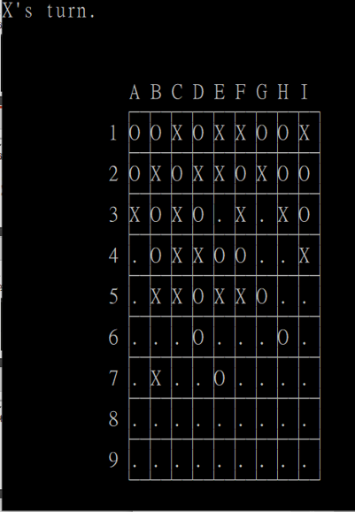

# Assembly Language Final Project
This is a simple gobang game.

You can use arrow key to move within the chess board, and press enter to confirm where to put the chess.

After someone won or tied, the game will ask if you want to play another round, type in y/Y to start a new game.

